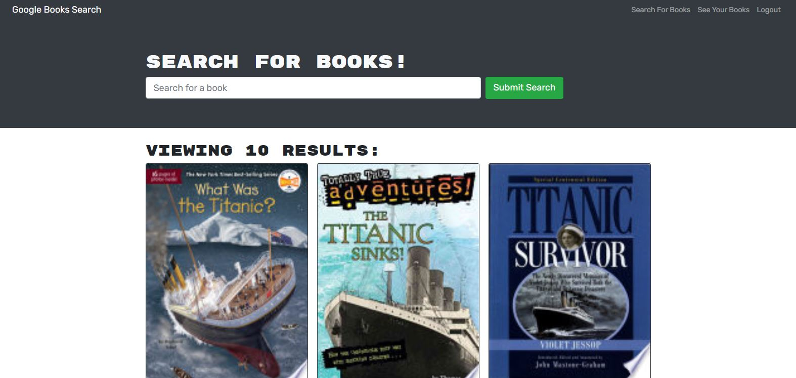

<h1 align="center">✌️🤟🙏👋  Book Search Engine  ✌️🤟🙏👋</h1>
<h1 align="center">

</h1>

## Description 
  
  The Book search engine is an application is leveraging the entire MERN stack and with a React front end, MongoDB database, and Node.js/Express.js server and API. It's set up to allow users to save book searches to the back end. The application is built using Google Books API search engine build with GraphQL API and Apollo Server. 

 
 
  ## Table of contents

- [Description](#description)
- [Installation](#installation)
- [Technology](#technology)
- [Usage](#usage)
- [Credits](#credits)
- [License](#license)
- [Tests](#tests)
- [Contributing Guide Lines](#contributing)
- [Questions](#questions)
 

## Installation
navigate to desired installation directory and run "git clone https://github.com/emilychhun/book-search-engine1".  After that, while in the root directory of the project inside the terminal, run "npm i" to install all node packages needed for the application.
 ## Technology
  
Below is a list of technologies used to build this app.
 
    
 1. Node
 2. React
 3. React DOM, React Router DOM
 4. Apollo-Server-Express, Apollo React Hooks, Apollo Boost
 5. Express
 6. GraphQL, Graphql-Tag
 7. MongoDB
 8. If-env
 9. Bcrypt
 10. JSON web token, JWT decode
 11. Mongoose
 12. react bootstrap, react bootstrap icons
 13. Lodash
 
  
## Usage
once installed with the npm dependencies, invoke the application by running "npm start" from the command line of the project's root directory
 
  
## Credits

- [emilychhun](https://github.com/emilychhun)

   
## License
MIT

  
## Contributing Guide Lines
none at this time
 
 
 
## Tests
once the app is started, try creating an account via the signup. k Once signed in, then search for a book and try saving the book to See Your Books.
 
 
## Questions
Feel free to reach out to us with any questions you have about Book Search Engine.
   

   *✋please contact us via Github with the information below:*
  

* Find me on GitHub: [emilychhun](https://github.com/emilychhun)

 

  ## Repo link:
 https://github.com/emilychhun/book-search-engine1
   

## Screenshots

